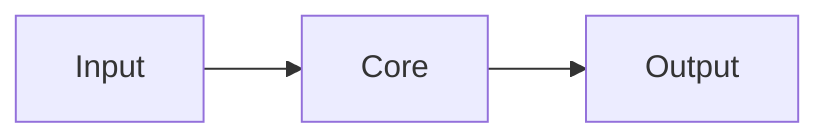
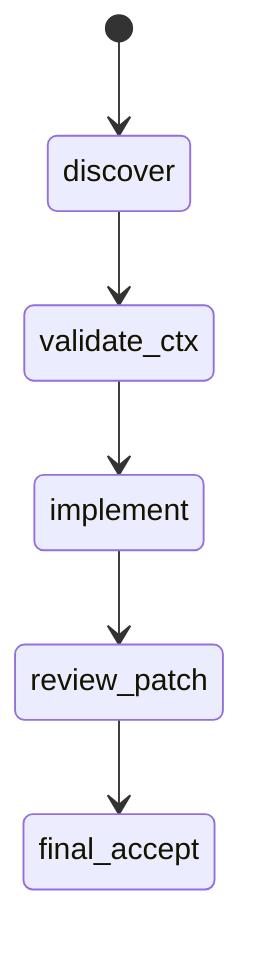

# Scout report — <topic>

## 0) Meta
- Repo: `codex-rs`
- Task: `<TASK-ID>`
- Slice: `<SLICE-ID>`
- Goal: `<what must be proven before patching>`
- Artifacts:
  - `ScoutReport.md`
  - `excerpt_spec.yml`
  - `context_pack.md`
  - `scout_map.state.json`
  - `scout_map.mmd`

## 1) Scope snapshot
- In scope: …
- Out of scope: …

## 2) Patch target contract
- Allowed touchpoints: …
- Forbidden touchpoints: …
- Verify command (single repro): `…`

## 3) Key invariants / constraints
Every item MUST have at least one `CODE_REF` and one short verbatim quote from `context_pack.md`.

- `<invariant>` (`CODE_REF::<crate>::<path>#Lx-Ly`)
- `<constraint>` (`CODE_REF::<crate>::<path>#Lx-Ly`)

## 4) Anchor map
- `CODE_REF::<crate>::<path>#Lx-Ly` — why this anchor matters.
- `CODE_REF::<crate>::<path>#Lx-Ly` — …

## 5) Excerpt specs
- Attach or inline `excerpt_spec.yml`.
- Preferred: anchor-first entries with `code_ref` + `label/why`; no ручной копипасты кода.
- Multi-anchor under single heading is allowed (including anchors from different files).
- Mermaid in section: inline (`mermaid`) or file-backed (`mermaid_file`), exactly one mode.
- Attach or inline generated `context_pack.md` (rendered from the same spec by `scripts/scout_pack.py`).
- Must cover all planned patch touchpoints.

## 6) Evidence quotes (verbatim, minimal)
- Claim: `<claim text>`
  - CODE_REF: `CODE_REF::<crate>::<path>#Lx-Ly`
  - Quote: `"<1-8 verbatim lines from context_pack excerpt>"`
  - Excerpt id: `<excerpt-id>`

## 7) Dependency map
### 7.1 Flow
- Source: `scout_map.mmd` (generated from `scout_map.state.json` via `just scout-map-render ...`)

### 7.2 Handoff / state (if needed)

## 8) High-confidence risks / edge cases
Every risk MUST have `CODE_REF` + quote.

- `<risk>` (`CODE_REF::<crate>::<path>#Lx-Ly`) — falsifier: `<cheapest check>`

## 9) Missing context items needed before patching
- `Need more context: <exact missing evidence>`
  - Expected evidence: `CODE_REF::<crate>::<path>#Lx-Ly`
  - Falsifier: `<single-step check>`

## 10) Patch readiness gates
- G1 Coverage: PASS|FAIL
- G2 Determinism: PASS|FAIL
- G3 Evidence-first: PASS|FAIL
- G4 Actionability: PASS|FAIL
- G5 Unknowns explicit: PASS|FAIL
- G6 Noise budget: PASS|FAIL
- G7 Quote-backed claims: PASS|FAIL

**Patch readiness: PASS|FAIL**
