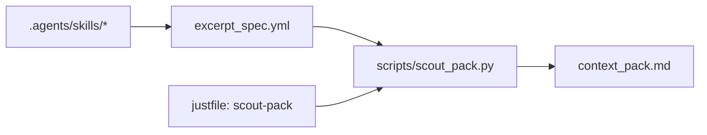

# Scout report — role_split: Scout context pack (example)

## 0) Meta
- Repo: `codex-rs` (monorepo: `Codex/`)
- Goal: показать каноничный формат “Scout context pack” так, чтобы Builder мог патчить без доразведки.
- Артефакты:
  - `excerpt_spec.yml` (machine-readable)
  - `context_pack.md` (generated; см. ниже)

## 1) Scope snapshot
- Покрыто: skill-контракт для Scout, обновление orchestrator skill, генератор pack’ов, и just recipe.
- Не покрыто: любые изменения runtime-гейтов (tools allowlist / apply_patch locks) — это отдельный аудит.

## 2) Key invariants / constraints
1) Scout не должен “дампить код” в отчёт: только `CODE_REF` + `excerpt_spec`.
2) `excerpt_spec` задаёт диапазоны строк 1-indexed/inclusive.
3) Генератор fail-closed: неверный путь/диапазон → ошибка, без частичного вывода.

## 3) Anchor map (CODE_REF)
- `../examples/scout_packs/role_split/excerpt_spec.yml:1-999` — входная спецификация (источник правды).
- `../../justfile:67-81` — recipe `scout-pack`.
- `../.agents/skills/scout_context_pack/SKILL.md:1-33` — контракт Scout.
- `../scripts/scout_pack.py:1-282` — генератор.

## 4) Excerpt spec
Файл: `../examples/scout_packs/role_split/excerpt_spec.yml`.

## 5) Diagrams (Mermaid)


## 6) Next actions
1) Сгенерировать context pack:

   ```bash
   cd codex-rs
   just scout-pack examples/scout_packs/role_split/excerpt_spec.yml -o examples/scout_packs/role_split/context_pack.md
   ```

2) Закоммитить `context_pack.md` рядом со spec (golden пример).

